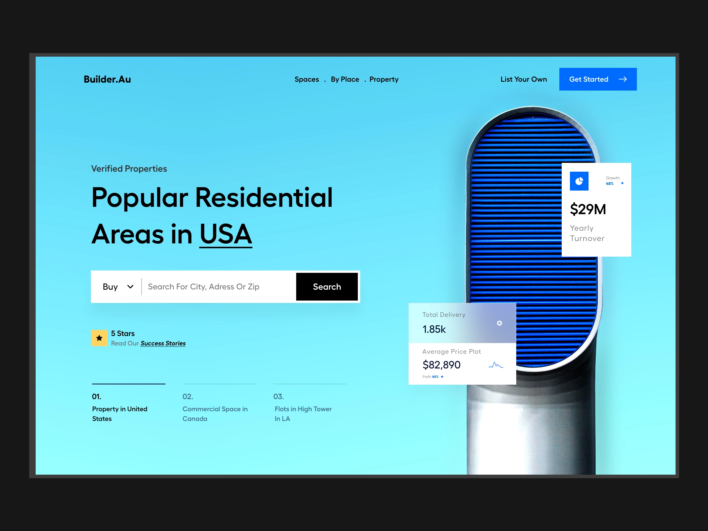
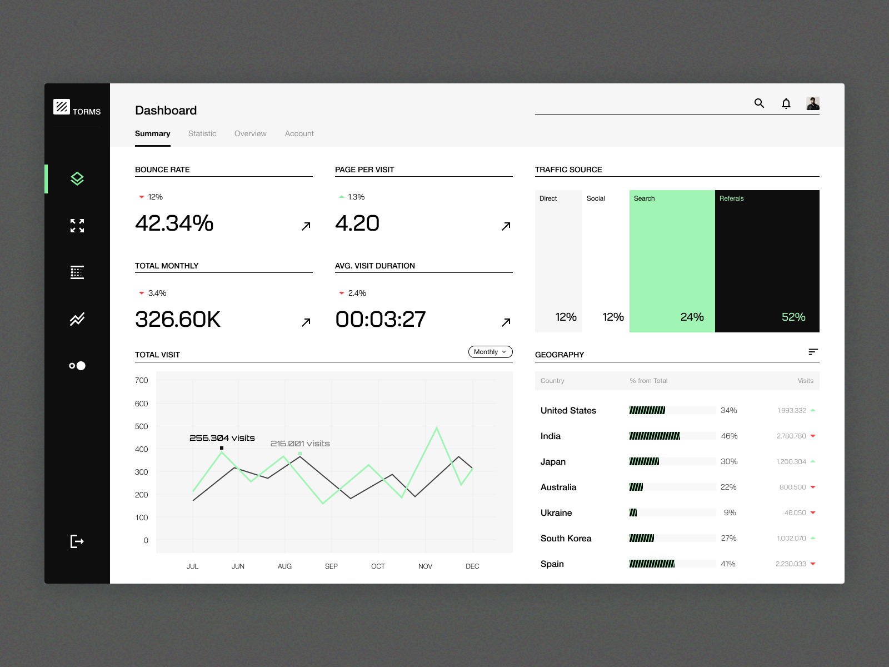
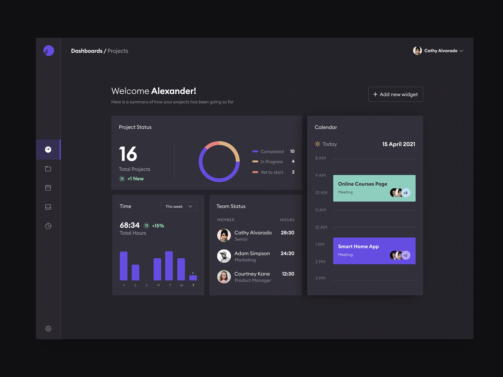

# DribbleUIs

This project is my implementation of UIs I find interesting on [https://dribbble.com](https://dribble.com).

## Guide
1. Clone the repository by running `git clone https://github.com/LevitKanner/dribbbleUIs.git`
2. Install application packages. Run `yarn` in the root directory of the application.
3. Run `yarn start` to start the application.
4. Open [http://localhost:3000](http://localhost:3000) to view it in your browser.

## Implemented UIs
### [Builder.Au](http://localhost:3000/)

### [Torms](http://localhost:3000/torms)

### [Projects](http://localhost:3000/projects)

